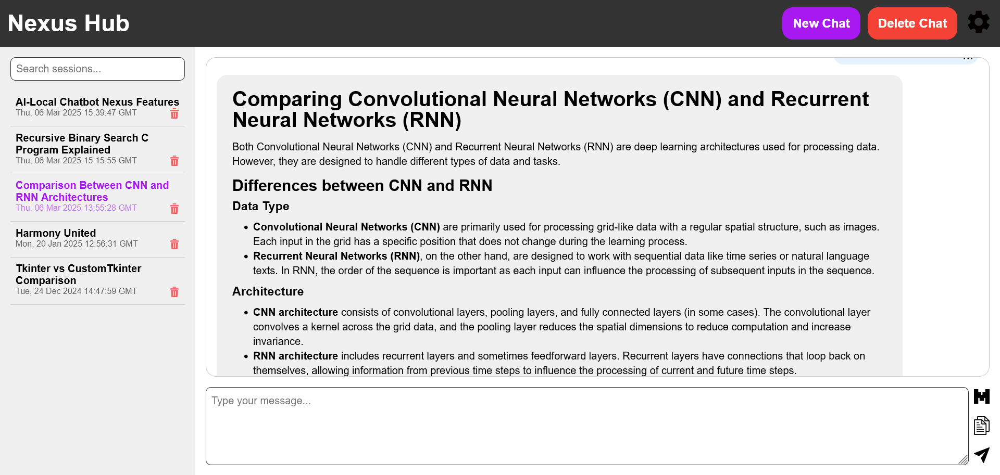
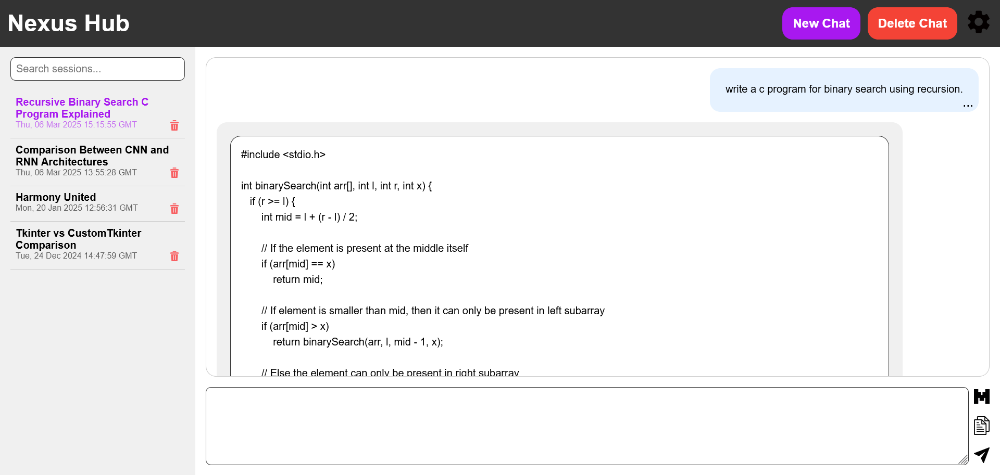

# Nexus: AI-Powered Local Chatbot

Nexus is an **AI-powered chatbot** that runs **entirely on your local machine**, requiring no external APIs. It features a **web-based interface** with a **Flask backend** and utilizes **Ollama models** available on the host machine to generate responses. 

## 🚀 Features

### 🔹 **AI Capabilities**
- Runs fully **offline**—no need for external APIs.
- Uses **Ollama models** installed on your system.
- Supports **switching between different models** easily.

### 🔹 **Multi-Modal Support**
- **Reads and processes multiple file formats**, including:
  - 📷 Images
  - 📄 PDFs, Word files, Text files, Excel files, PPT
  - 🖥️ Programming files (Python, Java, C++, etc.)
- Provides **file previews** in the UI before uploading.
- Allows **in-chat file reading** via a minimized chat bubble.

### 🔹 **Session Management**
- Supports **parallel chat sessions** with stored history.
- Users can **name sessions manually** or let the model generate titles.
- **Delete sessions** when no longer needed.

### 🔹 **Enhanced UI & Markdown Rendering**
- Supports Markdown rendering for LLM responses.
- Styles tables and lists to enhance readability.
- Provides a clean and organized chat experience.

## 🔧 Customization Options (LLM Parameters)
You can fine-tune the chatbot's behavior by adjusting model parameters:

| Parameter       | Description | Default / Range |
|---------------|-------------|----------------|
| `temperature` | Controls randomness (lower = more deterministic, higher = more creative) | `0.0` - `1.0` |
| `max_tokens` | Limits the response length | `2048` (Adjustable) |
| `top_k` | Selects top-k highest probability tokens | `None` (default: unlimited) |
| `top_p` | Nucleus sampling (higher = more diversity) | `None` (default: unlimited) |
| `repeat_last_n` | Prevents repetition of recent tokens | `None` (default: no limit) |
| `repeat_penalty` | Controls penalty for repeated words | `None` (default: no penalty) |
| `num_gpu` | Number of GPUs to use | `None` (auto) |
| `num_thread` | Number of CPU threads | `None` (auto) |

## 🛠 Installation & Setup

### 1️⃣ **Clone the Repository**
```bash
git clone https://github.com/Rahul-Samedavar/Nexus.git
cd Nexus
```

### 2️⃣ **Install Dependencies**
Note: create a virtual environment to avoid version conflicts with other packages.

Ensure you have Python installed, then run:
```bash
pip install -r requirements.txt
```

### 3️⃣ **Install Ollama & Models** (If not already installed)
Nexus requires **Ollama** to run models locally. Download and install it from the official website:
👉 [Ollama Installation Guide](https://ollama.com/download)

Once installed, pull the required models:
```bash
ollama pull <model-name>
```
Replace `<model-name>` with the desired model, such as `llama2`, `mistral`, or others available on Ollama.

### 4️⃣ **Install Tesseract OCR** (For Image Reading)
To enable image-to-text conversion, install **Tesseract OCR**:
- **Windows:** Download and install from [Tesseract OCR](https://github.com/UB-Mannheim/tesseract/wiki)
- **Linux (Debian/Ubuntu):**
  ```bash
  sudo apt install tesseract-ocr
  ```
- **Mac (Homebrew):**
  ```bash
  brew install tesseract
  ```

### 5️⃣ **Run the Application**
```bash
python app.py
```
The chatbot will be available at `http://localhost:5000`.

## 📸 Screenshots

### **1. Home Page**


### **2. Chat Interface**


### **3. Multimodal Chat**


### **4. Tables and Lists**


### **5. Programming**


### **6. Model Selection**


### **7. Customization**


## 📜 License
This project is licensed under the **MIT License**. See the [LICENSE](LICENSE) file for details.

---
💡 **Want to Contribute?** Feel free to open an issue or submit a pull request! 🚀

